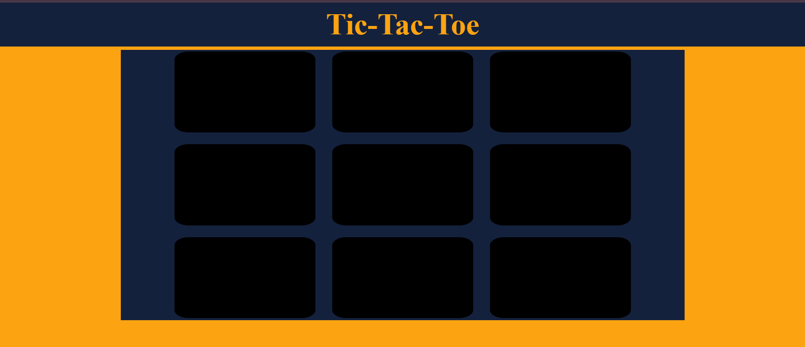

# Tac Tac Tao - Tic Tac Toe Game 🎮
A simple and fun Tic Tac Toe game made with **HTML**, **CSS**, and **JavaScript**. Play against a friend and see who wins!
---

## 🔗 Live Demo

[Play Now](https://github.com/builtbyusman/tic-tac-toe-game/blob/main/index.html)

---

## 📸 Screenshots

---

## 🧠 Features

- Two-player game
- Winner detection logic
- Draw detection
- Responsive design (mobile-friendly)
- Clean UI with simple animations

---

## 📂 Folder Structure
tac-tac-tao/
│
├── index.html
├── style.css
├── script.js
├── screenshots/
│ └── images/
└── README.md

---

## 🛠 Technologies Used

- HTML5
- CSS3
- JavaScript (vanilla)

---

## 👨‍💻 Author

Made by **MUHAMMAD USMAN**  
📫 [Email](mailto:developerusman23@gmail.com) 
💼 [LinkedIn](https://www.linkedin.com/in/muhammad-usman-862693367/)
